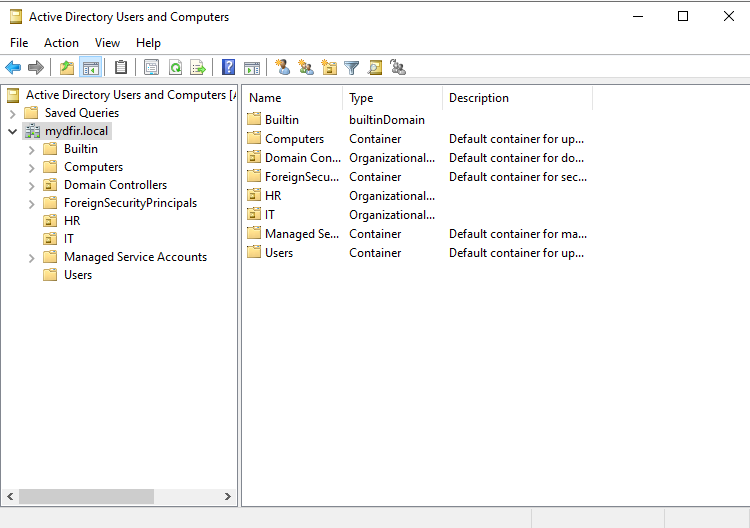

# 🏗️ Active Directory Home Lab Project

This project documents the complete setup and configuration of a cybersecurity Active Directory home lab for practicing enterprise security, threat detection, and security analysis in a controlled environment.

## 🔍 Project Overview

Active Directory is the backbone of most enterprise environments, making it critical for cybersecurity professionals to understand how to secure, monitor, and analyze AD infrastructure. This project builds a fully functional domain environment using VMware Workstation Player 17, Windows Server 2022, Windows 10, Kali Linux, and Ubuntu Server to:

- Set up and configure Active Directory Domain Services (ADDS)
- Practice domain administration and security hardening
- Generate enterprise telemetry with Sysmon + Splunk for security monitoring
- Simulate attack scenarios against domain infrastructure
- Develop skills in both red-team (attack) and blue-team (defense) methodologies

## ⚙️ Part 1: Lab Architecture Planning & Network Diagram

**Objective:** Design the lab architecture and understand component relationships

- Created comprehensive network diagram using draw.io
- Defined IP addressing scheme and network segmentation
- Mapped data flow between components (dotted green lines indicate log forwarding)
- Established hardware requirements (minimum 16GB RAM, 250GB storage)

**Key Design Decisions:**

- NAT Network configuration for VM communication with internet access
- Static IP assignments for all the machines to ensure consistent connectivity
- Centralized logging with Splunk for comprehensive visibility

**Lab Architecture:**

- **Domain**: `mydfir.local`
- **Network**: `192.168.194.0/24`
- **Domain Controller (Windows Server 2022)** - `192.168.194.155`
- **Splunk Server (Ubuntu 22.04)** - `192.168.194.150`
- **Target Machine (Windows 10)** - `192.168.194.151`
- **Attacker Machine (Kali Linux)** - `192.168.194.129`

  <p align="center">
  <br>
  <em>📸 Figure-1: Screenshot of Network diagram</em>
  </p>

## 🖥️ Part 2: Virtual Machine Installation

**Objective:** Install and configure all required virtual machines

### VMware Setup & Configuration

- Installed VMware Workstation Player 17 with proper dependencies
- Verified installation integrity using SHA-256 checksums

### Virtual Machine Installations

**Windows 10 Target Machine:**

- Downloaded Windows 10 ISO using Microsoft Media Creation Tool
- Configured VM with 4GB RAM, 60GB storage and 6 core CPU

 <p align="center">
  <br>
  <em>📸 Figure-2: Windows 10 virtual installed along with the configuration</em>
</p>

**Kali Linux Attacker Machine:**

- Downloaded pre-built Kali VMWare VM
- Imported the pre-built VM into VMware Workstation Player 17 via the `.vmx` file.
- Configured VM with 4GB RAM, 80GB storage and 4 core CPU
- Default credentials: kali:kali

 <p align="center">
  <br>
  <em>📸 Figure-3: Kali Linux installed along with the configuration</em>
</p>

**Windows Server 2022 (Domain Controller):**

- Downloaded Windows Server 2022 evaluation ISO
- Installed Windows Server 2022 Standard (Desktop Experience)
- Configured VM with 8GB RAM, 100GB storage and 4 core CPU

<p align="center">
  <br>
  <em>📸 Figure-4: Windows Server 2022 installed along with the configuration</em>
</p>

**Ubuntu Server 22.04 (Splunk Server):**

- Downloaded Ubuntu Server 22.04 ISO
- Configured VM with 8GB RAM, 100GB storage (higher specs for data ingestion) and 4 core CPU
- Set server's name to Splunk
- Set username: shauryajain
- Once installed run the command `sudo apt-get update && sudo apt-get upgrade -y` to update and upgrade all of the repositories

<p align="center">
  <br>
  <em>📸 Figure-5: Ubuntu Server 22.04 installed along with the configuration</em>
</p>

## 🌐 Part 3: Network Configuration & Monitoring Setup

**Objective:** Configure networking and install monitoring infrastructure

### Configuring Ubuntu Server 22.04 (Splunk Server)

- Assigned static IP addressing for the Splunk Server (`192.168.194.150`) and change Network Adapter to NAT for internet access and VM communication
- For that we edited the `00-installer-config.yaml` file using the command `sudo nano /etc/netplan/00-installer-config.yaml`

    ```yaml
    network:
    version: 2
    ethernets:
        ens33:
        dhcp4: no
        addresses:
            - 192.168.194.150/24   # pick an unused IP in the same subnet
        routes:
            - to: default
            via: 192.168.194.2   # confirmed gateway
        nameservers:
            addresses:
            - 8.8.8.8
            - 8.8.4.4
    ```

  - Apply and verify:

    ```yaml
        sudo netplan apply
        ip addr show ens33
        ping -c 2 8.8.8.8
    ```

- Splunk installation on ubuntu server

  - Ensure the VM has a reachable IP. As explained above, I used a static IP so the VM is easy to reach from any host in the NAT network
  - Enable SSH (fixed the “connection refused” error)
    - I first tried scp from my host and got:

       ```pgsql
        ssh: connect to host 192.168.194.150 port 22: Connection refused
       ```

    - Fixed inside Ubuntu VM:

        ```bash
        sudo apt update
        sudo apt install -y openssh-server
        sudo systemctl enable ssh
        sudo systemctl start ssh
        sudo systemctl status ssh    # should be "active (running)"

        ```

  - Copy the Splunk .deb into the VM
    - From my host (Windows PowerShell/CMD):

      ```bash
        scp splunk-10.0.0-e8eb0c4654f8-linux-amd64.deb shaurya@192.168.194.150:/home/shaurya/share
      ```

  - Install Splunk
    - Inside the vm

      ```bash
        mkdir share
        cd ~/share
        sudo dpkg -i splunk-10.0.0-e8eb0c4654f8-linux-amd64.deb
      ```

    - Splunk is now under `/opt/splunk` 

  - First start & license

    ```bash
        cd /opt/splunk/bin
        sudo ./splunk start --accept-license
    ```

    - On first start, Splunk prompts to set admin username/password.
    - Splunk Web listens on port 8000.

  - Enable auto-start on boot

    ```bash
        sudo /opt/splunk/bin/splunk enable boot-start
    ```

  - Log in to Splunk Web
    - From any machine on the NAT network we can access the splunk using the address `http://192.168.194.150:8000`

  <p align="center">
  <br>
  <em>📸 Figure-6: Ubuntu Server 22.04 with Splunk installed</em>
  </p>

  <p align="center">
  <br>
  <em>📸 Figure-7: Splunk web interface</em>
  </p>


### Configuring Windows Target Machine

- First, we will rename the windows machine to `target-PC`
- Then, we will assign static IP (`192.168.194.151`) to the machine and change Network Adapter to NAT for internet access and VM communication

  <p align="center">
  <br>
  <em>📸 Figure-8: Static IP assignment process</em>
  </p>

  <p align="center">
  <br>
  <em>📸 Figure-9: Static IP assignment proof</em>
  </p>

- Then, we will install [Splunk Universal Forwarder](https://splunk.com)
  - For the Receiving Indexer we will use the IP of Splunk/Ubuntu Server `192.168.194.150` on port `9997`

  <p align="center">
  <br>
  <em>📸 Figure-10: Splunk UF Installed</em>
  </p>

- Now, let's move to installing [Sysmon](https://learn.microsoft.com/en-us/sysinternals/downloads/sysmon) in the windows machine.
  - Once installed using the above link, let's install the [configuration file](https://github.com/olafhartong/sysmon-modular/blob/master/sysmonconfig.xml)
  - Run sysmon with the configuration file, using the command `.\sysmon.exe -i sysmonconfig.xml`
  
  <p align="center">
  <br>
  <em>📸 Figure-11: Sysmon Installed</em>
  </p>

- Now, configure the **Splunk Universal Forwarder (UF)** to ingest core Windows Event Logs (**Application, Security, System**) along with **Sysmon** logs and send them to the Splunk server, routing them into the custom index **`endpoint`**. This can be done by adding the appropriate entries in the `inputs.conf` file.
  - I used the `inputs.conf` below

    ```bash
        [WinEventLog://Application]
        
        index = endpoint
        
        disabled = false
        
        [WinEventLog://Security]
        
        index = endpoint
        
        disabled = false
        
        [WinEventLog://System]
        
        index = endpoint
        
        disabled = false
        
        [WinEventLog://Microsoft-Windows-Sysmon/Operational]
        
        index = endpoint
        
        disabled = false
        
        renderXml = true
        
        source = XmlWinEventLog:Microsoft-Windows-Sysmon/Operational
    ```

  - After that, we then need to restart the `SplunkForwarder` Service
  - But before that, we need to change `Log On As` from `NT Service\Splunk Forwarder` to `Local System account`
  - In Splunk Console, create a custom index named **`endpoint`** (Splunk Web → Settings → Indexes → New Index) to store host telemetry and Sysmon data.

    <p align="center">
    <br>
    <em>📸 Figure-12: Splunk Endpoint Index</em>
    </p>

### Configuring Windows Server 2022 (Domain Controller)

- First, of all we will rename the windows machine to `ADDC01`
- Then, we will assign static IP (`192.168.194.155`) to the machine and change Network Adapter to NAT for internet access and VM communication
- Then, we will install `Sysmon` and `Splunk Universal Forwarder` as done in the Windows Target Machine

### Data Ingestion Verification

- Verified log ingestion from both Windows machines
  <p align="center">
  <br>
  <em>📸 Figure-13: Splunk data ingestion proof</em>
  </p>

## 🏗️ Part 4: Active Directory Domain Services Installation

**Objective:** Install and configure Active Directory, promote server to Domain Controller, and join target machine to domain

### Domain Controller Setup

- Installed Active Directory Domain Services (ADDS) role through Server Manager
- Promoted server to Domain Controller with new forest: mydfir.local
- **Critical Security Note:** The ntds.dit file contains all AD data including password hashes - attackers target this file specifically

<p align="center">
  <br>
  <em>📸 Figure-14: ADDS installed with server promoted to DC with mydfir.local domain</em>
</p>

<p align="center">
  <br>
  <em>📸 Figure-15: DC login screen</em>
</p>

### Active Directory Structure & User Management

- Created Organizational Units (OUs) for IT and HR departments
- Added domain users:
  - Jenny Smith (jsmith) - IT Department
  - Terry Smith (tsmith) - HR Department
- Configured proper OU structure mimicking real enterprise environments

<p align="center">
  <br>
  <em>📸 Figure-16: Active Directory Users and Computers showing OUs and containers</em>
</p>

<p align="center">
  <br>
  <em>📸 Figure-17: Active Directory User jsmith</em>
</p>

<p align="center">
  <br>
  <em>📸 Figure-18: Active Directory User tsmith</em>
</p>

### Domain Join Process

- Updated Target machine DNS to point to Domain Controller (192.168.194.155)
- Successfully joined Target machine to mydfir.local domain
- Authenticated with domain user Jenny Smith (jsmith)
- Verified domain authentication and user profile creation

<p align="center">
  <br>
  <em>📸 Figure-19: Windows Machine DNS changed to Domain Controller IP</em>
</p>

<p align="center">
  <br>
  <em>📸 Figure-20: Windows Machine joins the domain</em>
</p>

<p align="center">
  <br>
  <em>📸 Figure-21: Login Screen showing the Domain User</em>
</p>

## 🎯 Part 5: Attack Simulation & Detection Analysis

**Objective:** Perform brute force attack simulation and implement Atomic Red Team for advanced testing

### Kali Linux Machine Configuration and RDP Authentication automation

- Set static IP for Kali Linux: `192.168.194.129`
  <p align="center">
  <br>
  <em>📸 Figure-22: Kali Linux Static IP assignment</em>
  </p>

- Before performing RDP authentication we need to make sure RDP is allowed
  
  <p align="center">
  <br>
  <em>📸 Figure-23: RDP enabled on Windows Machine</em>
  </p>

- Now, we wanted to automate testing of RDP authentication on the Windows target machine — verifying whether weak credentials allow remote login
  - Ran Crowbar to brute-force RDP.
  - Crowbar errored: `xfreerdp not found` → investigated.
  - Found FreeRDP v3 installed (`xfreerdp3`) → created `symlink` `/usr/bin/xfreerdp` -> `/usr/bin/xfreerdp3`.
  - Crowbar still returned No results found → determined Crowbar’s RDP module was incompatible with modern RDP negotiation.
  - Manually tested with `xfreerdp` (with `/sec:nla`) — success (confirmed credentials work).
    - `xfreerdp /u:MYDFIR\\tsmith /p:********** /v:192.168.194.151 /sec:nla`
  - Switched to Hydra/Ncrack for automated brute-forcing (or used FreeRDP manually when testing single creds).
    - `hydra -t 4 -V -f -l tsmith -P passwords.txt rdp://192.168.194.151`
  - Successfully compromised Terry Smith's account through password brute forcing
  - Generated 20 failed login attempts followed by 1 successful authentication

   <p align="center">
   <br>
   <em>📸 Figure-24: RDP Access to Windows target machine from KALI Linux</em>
   </p>

### Splunk Detection & Analysis

- **Failed Login Analysis (Event ID 4625):**
  - Detected multiple failed login attempts within seconds - clear brute force pattern
  - Source IP traced to Kali Linux machine (192.168.194.129)
  - Temporal correlation shows rapid successive attempts indicating automated attack

    <p align="center">
    <br>
    <em>📸 Figure-25: Splunk showing multiple Event ID 4625 (failed login) and Event ID 4624 (successful) events for Terry Smith</em>
    </p>

    <p align="center">
    <br>
    <em>📸 Figure-26: Splunk showing multiple Event ID 4625 (failed login) events for Terry Smith</em>
    </p>

- **Successful Authentication Detection (Event ID 4624):**
  - Identified successful login from Kali workstation
  - Correlated attack timeline: multiple failures followed by success
  - Key IOCs: Workstation name "Kali" and source IP 192.168.10.250

   <p align="center">
   <br>
   <em>📸 Figure-27: Event ID 4624 showing successful login with Kali workstation details</em>
   </p>

### Atomic Red Team Installation and Implementation

- Installed Atomic Red Team framework for MITRE ATT&CK technique testing
- Atomic Red Team (ART) is a library of tiny, repeatable tests that simulate MITRE ATT&CK techniques so you can validate detections and test defenses.
  - *Commands involved*
    - Open PowerShell as Administrator
    - Allow running scripts for this session (temporary) -> `Set-ExecutionPolicy Bypass -Scope Process -Force`
    - Run the install command (downloads and runs Red Canary helper to fetch atomics) -> `IEX (IWR 'https://raw.githubusercontent.com/redcanaryco/invoke-atomicredteam/master/install-atomicredteam.ps1' -UseBasicParsing); Install-AtomicRedTeam -GetAtomics`
    - Show details for a technique (example: Persistence `T1136`) -> `Invoke-AtomicTest T1136.001 -ShowDetails`
    - Run a specific atomic test - `Invoke-AtomicTest T1136.001`
  - *Issues faced*
    - `Invoke-AtomicTest` is implemented in `Invoke-AtomicRedTeam.ps1`
    - PowerShell reported it as “not recognized” because either:
      - the helper script/module was not installed on disk, or
      - it existed but was not imported (dot-sourced or Import-Module) into your current session, or
      - an earlier installer attempt failed due to network/DNS/proxy issues.
    - You later found `install-atomicredteam.ps1` under `C:\AtomicRedTeam\invoke-atomicredteam` and loaded it — that’s the missing step: load the helper
  
  <p align="center">
  <br>
  <em>📸 Figure-28: Installation of Atomic Red Team</em>
  </p>

  <p align="center">
  <br>
  <em>📸 Figure-29: Splunk detecting Atomic Red Team Activity</em>
  </p>

---

## 🧾 Key Learning Outcomes

- **Deepened Active Directory knowledge** — installed ADDS, promoted a Domain Controller, created OUs/users, configured DNS and domain joins; learned where sensitive artifacts (e.g., `ntds.dit`) live and how they are targeted.
- **Network & VM lab design** — planned NAT-based topology, static IP scheme, and VM sizing; learned trade-offs for isolation vs. internet access and how to document a reproducible architecture.
- **Telemetry pipeline & detection engineering** — deployed Sysmon + Splunk Universal Forwarder → Splunk index; verified Windows event and Sysmon ingestion; built searches and correlated 4625/4624 events to identify brute-force activity.
- **Threat emulation & validation** — installed and used Atomic Red Team to preview/run ATT&CK-style tests; practiced running safe previews (-ShowDetails) and controlled atomics in an isolated lab to validate detections.
- **Offensive tooling & troubleshooting** — used Kali tools (FreeRDP, Hydra/Ncrack) to simulate RDP brute force; learned tool compatibility issues and practical workarounds.
- **Operational best-practices** — learned to snapshot VMs, capture transcripts/logs, and enforce execution-policy/unblock-file patterns for reproducible, safe testing.
- **Documentation & reproducibility** — produced step-by-step commands, screenshots, and logging guidance suitable for teaching or publishing in a blog or README.

---

## 🧾 Issues faced during the project

- `Invoke-AtomicTest` not recognized
  - **Cause** - helper script/module (`Invoke-AtomicRedTeam.ps1`) either missing or not loaded into the session.
  - **Fix**

    ```powershell
        Set-ExecutionPolicy Bypass -Scope Process -Force #Allow running scripts for the current session

        Unblock-File 'C:\AtomicRedTeam\invoke-atomicredteam\install-atomicredteam.ps1' 
        . 'C:\AtomicRedTeam\invoke-atomicredteam\install-atomicredteam.ps1'
        Install-AtomicRedTeam -GetAtomics #Unblock and Load the installer and download atomics:

        Unblock-File 'C:\AtomicRedTeam\invoke-atomicredteam\Invoke-AtomicRedTeam.ps1'
        . 'C:\AtomicRedTeam\invoke-atomicredteam\Invoke-AtomicRedTeam.ps1'
        Get-Command Invoke-AtomicTest #Unblock & load the main helper, then confirm the command is available

        Invoke-AtomicTest T1136.001 -ShowDetails #Run a safe preview of a test
    ```

- SSH “Connection refused” to Ubuntu while transferring the Splunk `.deb` file
  - **Cause** - OpenSSH-server not installed/enabled by default.
  - **Fix**

    ```bash
        sudo apt update
        sudo apt install -y openssh-server
        sudo systemctl enable --now ssh
    ```

- Crowbar xfreerdp errors / RDP negotiation incompatibility
  - **Cause** - Crowbar expected a different FreeRDP binary; modern RDP negotiation can break older brute tools.
  - **Fix** - created symlink for `xfreerdp` (for quick tests) and moved to Hydra/Ncrack for automated brute forcing.

    ```bash
        sudo ln -s /usr/bin/xfreerdp3 /usr/bin/xfreerdp
    ```

- Splunk UF permissions / service account
  - **Cause** - default service account may not have expected log access.
  - **Fix** - set UF to run as `Local System`, configured `inputs.conf` to capture Sysmon and Windows Event channels, verified `endpoint` index in Splunk.

---

## 📌 Professional Value

- This project demonstrates:

  - Hands-on AD & security experience — demonstrates practical ability to build and secure an enterprise-like Windows domain, a key skill for sysadmins, detection engineers, and incident responders.
  - Detection engineering portfolio piece — end-to-end log ingestion, rule validation (with Atomic Red Team), and documented evidence (transcripts/screenshots) are strong artifacts to include on a CV or GitHub portfolio.
  - Improved troubleshooting & automation skills — diagnosing network/proxy, PowerShell execution policy, and tool compatibility issues shows operational maturity and readiness for real-world SOC/IR roles.
  - Reproducible methodology for teams — architecture diagrams, step-by-step install commands, and safe testing practices provide a repeatable process that security teams can adopt for training and validation.
  - Cross-functional empathy — working with offensive tools (Kali) and defensive tooling (Splunk, Sysmon) builds the ability to communicate between red and blue teams and to translate attack techniques into reliable detection logic.

---

## 🔗 References

- [YouTube Series Part 1](https://www.youtube.com/watch?v=mWqYyl89QaY) – Creating a Logical Diagram
- [YouTube Series Part 2](https://www.youtube.com/watch?v=2cEj3bS5C0Q) – Installing VM's in Type-2 Hypervisor
- [YouTube Series Part 3](https://www.youtube.com/watch?v=uXRxoPKX65Q) – Installing and Configuring Sysmon and Splunk on our Target Machine
- [YouTube Series Part 4](https://www.youtube.com/watch?v=1XeDht_B-bA) - Installing and Configuring AD on the server etc and Domain Join the target windows machine
- [YouTube Series Part 5](https://www.youtube.com/watch?v=orq-OPIdV9M&t=1s) - Using Kali Linux to perform a brute-force attack, setup and install ART for detection engineering

---
